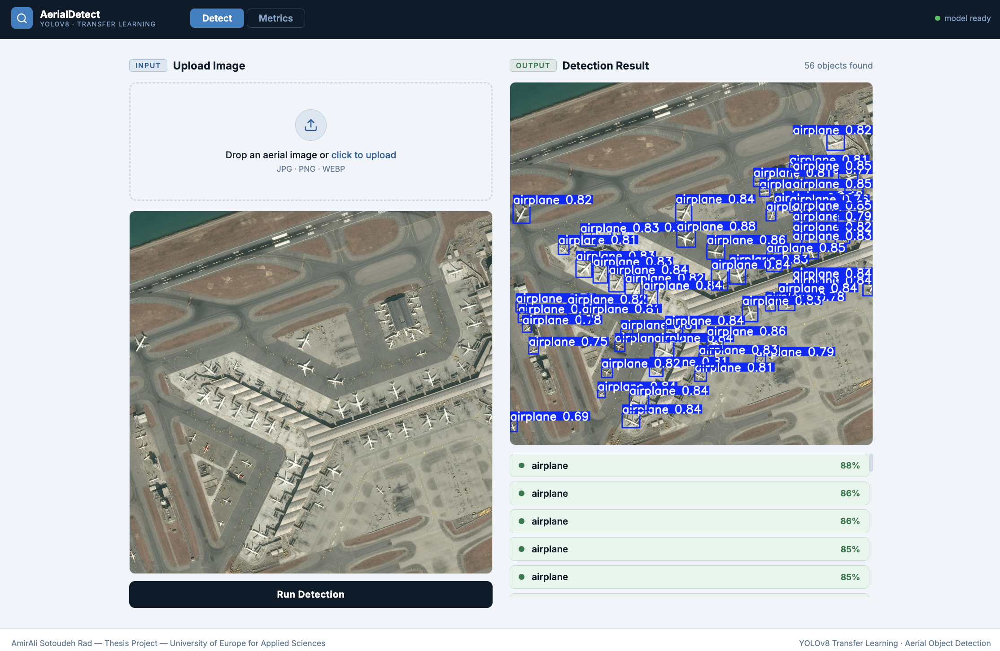
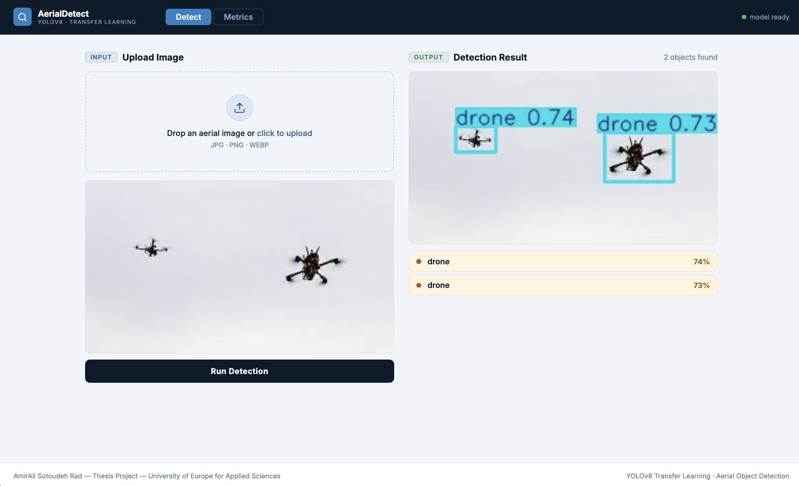

# AerialDetect - YOLOv8 Transfer Learning for Aerial Vehicle Detection

AerialDetect is a computer vision project developed as part of a BSc thesis at the University of Europe for Applied Sciences.

The project uses **YOLOv8 transfer learning** to detect two civilian aerial object classes:

-  Airplane
-  Drone

The model was trained on a custom dataset created by combining two public datasets and converting all annotations into YOLO format.

---

## Project Overview

This project investigates whether pre-trained YOLOv8 models can be effectively adapted for aerial vehicle detection using transfer learning.

Main tasks included:

- Dataset preparation and merging
- Annotation conversion to YOLO format
- YOLOv8 fine-tuning
- Model evaluation
- FastAPI-based web application deployment

---

## Dataset

Two public datasets were used:

1. Airbus Aircrafts Sample Dataset
2. Drone YOLO Detection Dataset

Final class mapping:

```text
0 → airplane
1 → drone
```

Dataset split:

| Split | Images |
|---------|---------:|
| Train | 2881 |
| Validation | 643 |
| Test | 589 |

---

## Models

The following pre-trained YOLOv8 models were evaluated:

| Experiment | Model | Epochs |
|------------|--------|---------|
| E1 | YOLOv8n | 10 |
| E2 | YOLOv8n | 30 |
| E3 | YOLOv8s | 30 |

---

## Results

| Model | Precision | Recall | mAP50 | mAP50-95 |
|---------|---------:|---------:|---------:|---------:|
| YOLOv8n (10 epochs) | 0.887 | 0.845 | 0.906 | 0.530 |
| YOLOv8n (30 epochs) | 0.916 | 0.882 | 0.918 | 0.555 |
| YOLOv8s (30 epochs) | **0.907** | **0.894** | **0.919** | **0.568** |

The best overall model was **YOLOv8s trained for 30 epochs**.

---

## Web Application

A simple FastAPI-based web application was developed to demonstrate the trained model.

### Airplane Detection



### Drone Detection



Features:

- Image upload
- YOLOv8 inference
- Bounding box visualization
- Confidence scores
- Detection metrics display

---

## Technologies Used

- Python
- PyTorch
- Ultralytics YOLOv8
- OpenCV
- Pandas
- Matplotlib
- FastAPI
- HTML/CSS/JavaScript
- Kaggle Notebooks

---

## Repository Structure

```text
├── dataset/
├── notebooks/
├── models/
├── backend/
├── frontend/
├── results/
└── README.md
```

---

## Author

**Amirali Sotoudeh Rad**  
BSc Software Engineering  
University of Europe for Applied Sciences

### Supervisors

- Prof. Dr. Rand Kouatly
- Prof. Dr. Iftikhar Ahmed

---

## Citation

```text
Sotoudeh Rad, A. (2026).
Object Detection of Aerial Vehicles Using YOLO-Based Transfer Learning.
BSc Thesis, University of Europe for Applied Sciences.
```
